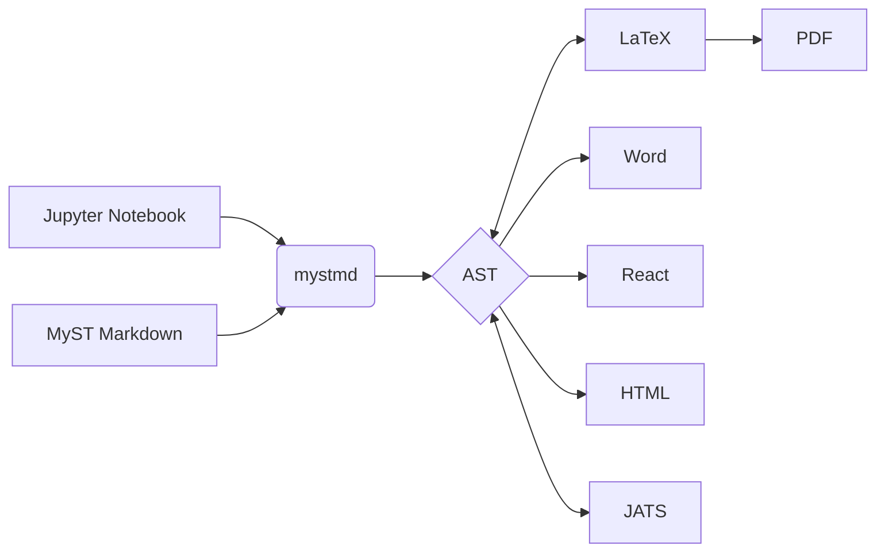

(sec-background-movtivation)=
## 背景动机

最近想更新一下自己的博客，博客原先的方案是 [obsidian-zola](https://github.com/ppeetteerrs/obsidian-zola)，这是一个 markdown 写内容的静态站点生成器。
使用它的体验还是很好的，它有完整的 common mark 支持，也有 latex 公式的渲染，而且也和 obsidian 的双链图有很好的联动，可以在页面中展示引用关系。
但来回跳转的链接并未带来想象中的良好体验，每次点进新的链接，都相当于切换了新的上下文，要重新阅读，读着读着，对跳转前的内容的印象就很浅了。
在读传统的 pdf 论文的时候，也有类似的体验，往往我只是想看看图/公式/引文的内容，理清它和当前语句的指代关系，但也只能点击引用，跳到这些图/公式/引文的位置，看清楚内容，再切回来。

那自然地解决方案是，在跳转链接上做一个悬浮预览窗，减少来回跳转的次数。
由此，我就搜到了一个可以解决这个问题的知名的前端库 [tippyjs](https://github.com/atomiks/tippyjs)。
但 tippyjs 只是提供了一个悬浮显示的插件，悬浮显示的内容还需要我们自己填写。
如果要达到悬浮在图/公式/引文的位置时显示这些内容，就需要把这些内容对应的 html 用 tippy 组件包裹。
由于博客网页是静态站点生成器导出的，我不直接触碰 html 内容，顺着这个思路，我就得去魔改 obsidian-zola 的解析渲染部分的逻辑，截获相应的内容，并插入适当的 tippy 控件。
既然有一定工程量，那不如先看看使用 tippyjs 的其他仓库，看看有没有人已经做了类似的事。
于是来到了 [sphinx-tippy](https://github.com/sphinx-extensions2/sphinx-tippy) 这个仓库，详细了解了一下 sphinx 生态，顺便给这个 sphinx 插件修了个 bug。
Sphinx 下很知名的一个主题是 [jupyter-book](https://github.com/jupyter-book/jupyter-book)，并由此接触了这个社群，发现了他们正在活跃开发的项目 [mystmd](https://github.com/jupyter-book/mystmd)。
在我看来，它相较于其他的 markdown 静态站点生成器有以下优势：

1. 引用预览。悬浮在引用上，就可以预览引用内容。并且它做得更极致，可以在预览页面递归地往下查看“预览页面里的引用”的预览。
2. 更多学术特化，增加了规范化的图注语法；规范的公式表情标注；对引用链接是 doi，wiki 等内容也做了预览解析...
3. 支持运行代码内容。用远程的 jupyter hub/binder 或者 jupyterlite 来支持内容的运行，可做交互性更强的内容。
4. 可以导出成 latex typst 来转 pdf, 而不止支持导出为站点，方便做些传统场景的内容草稿导出。

当然也有一些不足，但感觉能靠 pr 解决：

1. 评论区，博客还是有评论感觉才像博客。静态博客常用的 giscus 和 utterance 暂时还没得到支持。（但 jupyterbook 是有这些插件的）
2. 代码的 in browser 运行。 jupyterlite 是靠 wasm 来运行 python 和 python 的 c extension 的。没有额外编译支持的包就不能 in browser 运行了。但个人常用的 `numpy` 之类的包都是有的，只有 `pytorch` 还未得到支持。

(sec-resources)=
## 上手资源

- 官方文档：[https://mystmd.org/](https://mystmd.org/)。 它能解决 80% 到 90% 的问题
- 示例项目：[tlke-finitevolume](https://simpeg.xyz/tle-finitevolume/) （但感觉系列博客类偏少）
- 剩下就只能读源码读 roadmap 了。

(sec-basic-usage)=
## 基本使用

本节用于展示 mystmd 的一些使用语法案例和效果。
由于 mystmd 的扩展语法比较多，而且达成同一个效果的方式多种多样。
这里展示一些我常用的语法子集。
子集的选取原则是，尽可能做到与 [CommonMark](https://en.wikipedia.org/wiki/Markdown#Standardization) 和 [GFM](https://en.wikipedia.org/wiki/Markdown#GitHub_Flavored_Markdown) 的语法保持兼容，若不一致则渲染后至少能看出原始语义。

(sec-pure-typing)=
### 纯文字书写

按照如下约定写。

1. 分段：用换行加一个空行来分段，用换行不加空行来分割句子。分割句子主要是为了语义清晰和 git 追踪友好，并不必须。
2. 标题和分节: 还是使用 一个或多个 `#` 来起不同等级的标题。但由于博客还需要抽取每篇文章的标题放在侧边栏导航，所以尽量只用一个一级标题来作为全文标题，如果在 frontmatter 里手工设置了全文标题，则不使用一级标题。
3. 斜体、加粗、内联代码。常规的使用 一对 `*`，两对 `*` 和一对 \` 来包裹相应的内容。

(sec-figure)=
### 图片

mystmd 支持常规的 markdown 图片插入语法，也即 ``。
在更学生的场景里，人们通常会在图下方加入图注标题，并给图打上标签编号，方便在后文中引用。
在这里，我会使用 mystmd 扩展的指令语法 (directive) 中图片相关的语法。通过如下格式来实现图注和标签编号。

```
:::{figure}
:label: 可选，图片的标签，用于引用时指代，一般用 fig-xx 的格式写
:width: 可选，填 xx% ，用于指定图片的宽度


图片的图注标题
:::
```

用这样的格式，就能实现如 @fig-fruit 所示的带图注，支持用 `@标签名` 或者 `[](#标签名)` 来引用的图，并最大程度在不支持 mystmd 的平台上，也能正确渲染图片部分。（因为由冒号展开的指令块在这些平台上会被当成普通的文段，从而解析出原来的 `` 语法）

:::{figure}
:label: fig-fruit


水果！
:::

(sec-math)=
### 数学公式

CommonMark 是没有公式支持的，但是 GFM 和大部分扩展的 markdown 解析器都支持公式语法。
通常来说最小的支持就是用 `$` 来包裹内联公式和用 `$$` 来包裹跨行公式。
在 MyST 里既支持这些语法，也有一个 `math` 的指令块，类似于 latex 的 `\begin{equation}` 和 `\end{equation}` 来包裹公式和渲染和控制公式的编号。
但 `math` 指令块和 `figure` 指令块的设计不同，里面不能再用 `$$` 来包裹公式，只能直接做公式编码。
处于兼容性考虑，我并不使用这个指令，而是使用 `$$` 来包裹公式，然后用前置的 `(标签名)=` 来给公式块加标签，即：

```
(标签名，通常是eq:xxx)=
$$
公式内容
$$
```

使用这个语法，可以得到式 @eq-maxwell 所示的麦克斯韦方程。

(eq-maxwell)=
$$
\begin{aligned}
    \nabla \cdot \mathbf{E} &= \frac{\rho}{\epsilon_0} \\
    \nabla \cdot \mathbf{B} &= 0 \\
    \nabla \times \mathbf{E} &= -\frac{\partial \mathbf{B}}{\partial t} \\
    \nabla \times \mathbf{B} &= \mu_0 \mathbf{J} + \mu_0 \epsilon_0 \frac{\partial \mathbf{E}}{\partial t}
\end{aligned}
$$

(sec-cross-ref)=
### 交叉引用

使用特定语法块指令块中的 `label` 字段，或者在任意内容块之前使用 `(标签名)=` 就可以为内容块定义标签。
然后使用如下两种语法都可以引用标签。

1. `@标签名`: 该方法比较简单直觉，优先使用
2. `[](#标签名)`: 该方法比较冗长，但可以引用不同文章里的标签，即用 `[](其他文章的无后缀路径名#标签名)` 来引用

引用外部链接时，和 Commmark 一样可以使用 `[showing text](url)` 来引用。
但 MyST 对学术向的引用做了一些特化。
详细的指引可见[官方文档中的相关章节](https://mystmd.org/guide/external-references)，这里我摘录我常用的功能：

1. 当引用的链接是 wikipedia, doi, github issue/pull request时，会自动解析并给出悬浮预览，此外不写 showing text 也会填写自动解析的内容（wiki的标题，doi 的作者和发表年份）。但处于兼容其他 markdown 语法的考虑，不建议不写 showing text。
2. 引用 doi 后，会自动在文章结尾生成一个参考文献列表。

如： [ResNet](https://doi.org/10.48550/arXiv.1512.03385) 是何凯明的工作，它被广泛应用于当今的深度学习模型中，这是它的[维基百科词条](https://en.wikipedia.org/wiki/Residual_neural_network)，最原始的实现还是使用的 caffe，比如 [ResNet50的caffe声明](https://github.com/KaimingHe/deep-residual-networks/blob/master/prototxt/ResNet-50-deploy.prototxt)

(sec-code-block)=
### 代码块

### admonition


## New section

`init`[^or-kill-process]

[^or-kill-process]: If you have already started the server, use {kbd}`Ctrl`-{kbd}`C` to kill the process.

<wiki:gravitational_waves>

[test_like_to_github](https://github.com/jupyter-book/mystmd/blob/78d16ee1a5b7b3aeaed0c5ea25c230d48fa26a64/packages/myst-transforms/src/links/plugin.ts#L9)
[test_wiki_fr_like](https://fr.wikipedia.org/wiki/Croissant_(viennoiserie))

[](https://doi.org/10.5281/zenodo.6476040)

[rrid_test](https://scicrunch.org/resolver/SCR_008394)
 
[](https://doi.org/10.48550/arXiv.2406.07209)


[two same ref test](https://doi.org/10.48550/arXiv.2406.07209)


```{tip} Admonition _title_
Here is an admonition!
```

> [!NOTE]
> Highlights information that users should take into account, even when skimming.
> ```{figure} https://github.com/rowanc1/pics/blob/main/sunset.png?raw=true
> :label: myFigure
> :alt: Sunset at the beach
> :align: center
> 
> Relaxing at the beach 🏝 🌊 😎
> ```

:::{figure}
:label: my-figure
:align: left

(my-figure-fruit)=


Some pictures of fruit and the ocean!
:::


just some text

:::{figure}
:label: my-figure-single
:align: left


Some pictures of fruit and the ocean!
:::

:::{iframe} https://player.bilibili.com/player.html?bvid=BV1zy411e73B&p=1&autoplay=0&muted=0
:width: 100%
Get up and running with MyST in Jupyter!
:::

$$
Ax=b
\label{one-liner} 
$$
[](#one-liner)


$$
E = mc^2
$$

:::{list-table} This table title
:header-rows: 1
:label: example-table

* - Training
  - Validation
* - 0
  - 5
* - 13720
  - 2744
:::

test @example-table

:::{prf:axiom} Completeness of $\mathbb{R}$
:label: my-axiom

Every Cauchy sequence on the real line is convergent.
:::



```{code-cell} python
hello = "hello"
there = "there"
phrase = f"{hello}, {there}!"
print(phrase)
```

% just work in a .ipynb file

````{figure}
:label: test


```{kroki}
:src: plantuml
:alt: "test"
:align: left
:width: 200

skinparam ranksep 20
skinparam dpi 125
skinparam packageTitleAlignment left

rectangle "Main" {
  (main.view)
  (singleton)
}
rectangle "Base" {
  (base.component)
  (component)
  (model)
}
rectangle "<b>main.ts</b>" as main_ts

(component) ..> (base.component)
main_ts ==> (main.view)
(main.view) --> (component)
(main.view) ...> (singleton)
(singleton) ---> (model)

```

````


